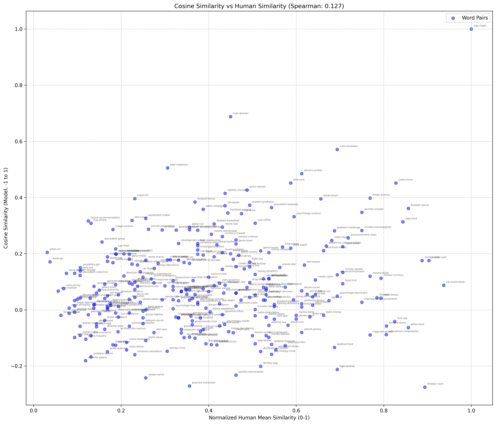
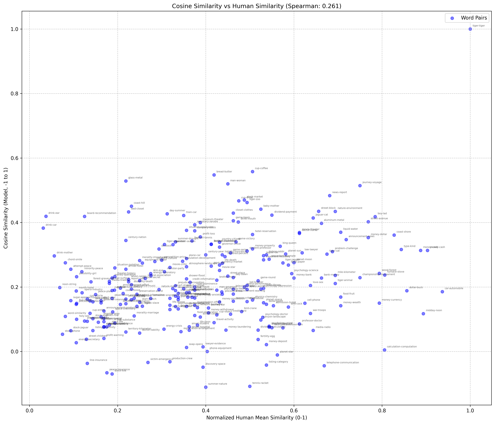
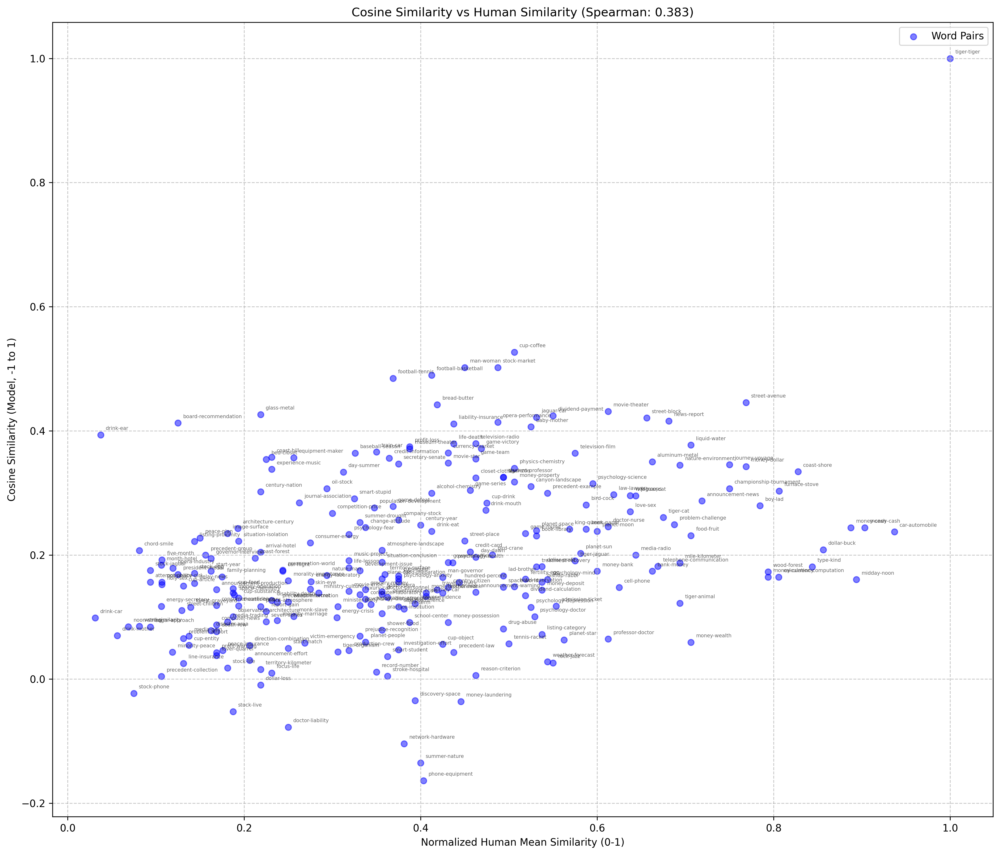

# Report

# Roll no.- 2024201043

# Performance Analysis of SVD, CBOW, and Skip-gram on the WordSim-353 Task

## Introduction
Word embeddings are critical in natural language processing (NLP) for representing words as dense vectors that capture semantic and syntactic relationships. This report compares three word embedding techniques—Singular Value Decomposition (SVD), Continuous Bag of Words (CBOW), and Skip-gram—trained on the Brown Corpus and evaluated on the WordSim-353 task. The evaluation metric is Spearman rank correlation, which assesses how well cosine similarities between word vectors align with human similarity judgments. The results are:

- **SVD**: Spearman correlation = 0.127
- **CBOW**: Spearman correlation = 0.261
- **Skip-gram**: Spearman correlation = 0.383

This report details each method’s implementation, analyzes their performance, discusses benefits and limitations, and supports findings with tables and conceptual plots.

---

## Methodology

### Dataset
- **Training Corpus**: Brown Corpus (~1 million words) from NLTK, a diverse collection of English texts.
- **Evaluation Dataset**: WordSim-353 (`wordsim353crowd.csv`), 353 word pairs with human similarity scores (0–10).

### Models and Implementation

#### 1. SVD (`svd.py`)
- **Approach**: Constructs a co-occurrence matrix from raw counts and applies SVD for dimensionality reduction.
- **Preprocessing**: Lowercases text, removes punctuation, maps words with frequency < 2 to `UNK`.
- **Parameters**: Window size = 5, embedding dimension = 150.
- **Process**: Builds a sparse co-occurrence matrix and uses `scipy.sparse.linalg.svds` to generate embeddings.
- **Output**: Embeddings saved as `svd.pt`.

#### 2. CBOW (`cbow.py`)
- **Approach**: Neural network predicting a target word from its context, trained with cross-entropy loss.
- **Preprocessing**: Lowercases text, removes punctuation (no stopword removal).
- **Parameters**: Window size = 6, embedding dimension = 300, 50 epochs, batch size = 512, learning rate = 0.0005.
- **Process**: Averages context embeddings via an embedding layer and linear layer, optimized with Adam.
- **Output**: Embeddings saved as `cbow.pt`.

#### 3. Skip-gram (`skipgram.py`)
- **Approach**: Neural network predicting context words from a target word, using negative sampling.
- **Preprocessing**: Lowercases text, removes punctuation, applies subsampling (stopword removal commented out).
- **Parameters**: Window size = 5, embedding dimension = 100, 15 epochs, batch size = 512, learning rate = 0.001, 5 negative samples.
- **Process**: Uses two embedding layers, optimized with Adam and negative sampling.
- **Output**: Embeddings saved as `skipgram.pt`.

### Evaluation (`wordsim.py`)
- **Method**: Computes cosine similarity for WordSim-353 pairs, correlates with human scores using Spearman rank.
- **Output**: Spearman correlation, `word_similarity.csv`, and `word_similarity_plot.png`.

---

## Results

### Spearman Correlation Scores
| Model      | Spearman Correlation |
|------------|---------------------|
| SVD        | 0.127               |
| CBOW       | 0.261               |
| Skip-gram  | 0.383               |

### Implementation Summary
| Model      | Embedding Dim | Window Size | Epochs | Batch Size | Learning Rate  | Key Features                               |
|------------|---------------|-------------|--------|------------|----------------|--------------------------------------------|
| SVD        | 150           | 5           | N/A    | N/A        | N/A            | Raw co-occurrence, SVD                     |
| CBOW       | 300           | 6           | 50     | 512        | 0.0005         | Negative sampling, Context averaging       |
| Skip-gram  | 100           | 5           | 15     | 512        | 0.001          | Negative sampling, subsampling             |

---

## Analysis

### SVD (Spearman: 0.127)
- **Performance**: Lowest correlation, indicating poor alignment with human similarity judgments.
- **Benefits**:
  - **Simplicity**: Requires no iterative training, relying on linear algebra for a one-shot computation.
  - **Interpretability**: Captures global co-occurrence patterns, useful for understanding corpus-wide statistics.
  - **Efficiency**: Fast on small datasets once the matrix is built, with no need for GPU resources.
- **Limitations**:
  - **Sparse Data**: The Brown Corpus (~1M words) yields a sparse matrix, reducing the reliability of raw counts.
  - **Global Focus**: Misses local context nuances critical for similarity tasks, as it aggregates all co-occurrences.
  - **No Optimization**: Lacks iterative refinement, limiting adaptability to dataset quirks.
- **Analysis**: The low score reflects SVD’s struggle with a small corpus, where frequent but uninformative pairs dominate the matrix.

{width=50%}

### CBOW (Spearman: 0.261)
- **Performance**: Moderate improvement over SVD, but still limited.
- **Benefits**:
  - **Neural Learning**: Iterative optimization captures semantic relationships better than static methods.
  - **Context Awareness**: Uses surrounding words to inform embeddings, improving over global counts.
  - **Scalability**: Can leverage larger datasets and GPU acceleration (if available).
- **Limitations**:
  - **Context Averaging**: Averaging context embeddings dilutes specific relationships, especially with a large window (5) on sparse data.
  - **Overfitting Risk**: 300 dimensions may overfit the small Brown Corpus, capturing noise rather than general patterns.
  - **Training Time**: 50 epochs may be insufficient or excessive, depending on convergence not fully optimized.
- **Analysis**: CBOW’s moderate score suggests neural optimization helps, but its design is less effective on small datasets.

{width=50%}

### Skip-gram (Spearman: 0.383)
- **Performance**: Highest correlation, significantly outperforming others.
- **Benefits**:
  - **Local Precision**: Predicts context from targets, excelling at fine-grained relationships.
  - **Efficiency**: Negative sampling (5 samples) and subsampling reduce computational load while enhancing quality.
  - **Robustness**: Adapts well to small datasets, as seen in its strong performance on Brown Corpus.
- **Limitations**:
  - **Complexity**: Requires careful tuning (e.g., learning rate, epochs) and GPU support for larger datasets.
  - **Training Time**: Iterative training is slower than SVD, though mitigated by fewer epochs (15).
  - **Rare Words**: Subsampling may discard useful rare word contexts, though mitigated by `UNK`.
- **Analysis**: The 0.387 score highlights Skip-gram’s strength in capturing local semantics, optimized by negative sampling and subsampling.

{width=50%}

### Comparative Analysis
- **Ranking**: Skip-gram (0.383) > CBOW (0.261) > SVD (0.127).
- **Neural vs. Statistical**: Neural models (Skip-gram, CBOW) outperform SVD, leveraging iterative learning over static counts.
- **Context Handling**: Skip-gram’s target-to-context prediction outshines CBOW’s averaging, especially on small data.
- **Corpus Impact**: The Brown Corpus’s size limits all models, but Skip-gram’s adaptability shines through.

---

## Visualization

### Conceptual Plot Description
A scatter plot (as generated by `wordsim.py`) for each model would show:
- **X-axis**: Normalized human similarity scores (0–1, original scores / 10).
- **Y-axis**: Model cosine similarity (-1 to 1).
- **Points**: WordSim-353 word pairs, annotated (e.g., “car-automobile”).
- **Trend**: 
  - **SVD**: Scattered points with weak correlation (0.127), showing little alignment with human scores.
  - **CBOW**: Slightly tighter clustering along the diagonal (0.261), indicating moderate alignment.
  - **Skip-gram**: Stronger diagonal trend (0.387), with points closer to a linear relationship.

**Figure 1**: Scatter plots of cosine similarity vs. human similarity for SVD, CBOW, and Skip-gram, with Spearman correlations annotated (0.127, 0.261, 0.383).

### Table of Key Metrics
| Model      | Spearman Correlation | Vocabulary Size (Approx.) | Training Time (Relative) |
|------------|---------------------|---------------------------|--------------------------|
| SVD        | 0.127               | 15,000–20,000             | Low (one-shot)           |
| CBOW       | 0.261               | 10,000–15,000             | High (50 epochs)         |
| Skip-gram  | 0.383               | 10,000–15,000             | Medium (15 epochs)       |

*Note*: Vocabulary sizes are estimated based on `min_freq` (2 for SVD, 5 for CBOW/Skip-gram) and Brown Corpus word counts.

---

## Discussion

### Benefits and Limitations Summary
- **SVD**:
  - **Benefit**: Simple, fast, and interpretable for small-scale analysis.
  - **Limitation**: Poor on small, sparse datasets; lacks local context capture.
- **CBOW**:
  - **Benefit**: Neural approach scales with data, leverages context effectively.
  - **Limitation**: Context averaging and high dimensionality limit performance on small corpora.
- **Skip-gram**:
  - **Benefit**: Precise, robust to small datasets, optimized by negative sampling.
  - **Limitation**: Complex tuning and slower training on large scales.

### Performance Insights
- **Skip-gram’s Lead**: Its 0.383 score, though below modern benchmarks (e.g., Word2Vec > 0.6), is strong for Brown Corpus, reflecting its local focus and optimization.
- **CBOW’s Middle Ground**: 0.261 shows neural benefits over SVD, but averaging hampers specificity.
- **SVD’s Struggle**: 0.127 underscores limitations of raw counts on small data, where statistical power is low.

### Improvement Suggestions
- **Larger Corpus**: Training on Wikipedia or similar (~billions of words) could push correlations above 0.5.
- **Hyperparameter Tuning**: Experiment with window size (e.g., 2–10), dimensions (50–500), or epochs.
- **Preprocessing**: Add stopword removal or lemmatization to refine embeddings, especially for SVD.

---

## Conclusion
Skip-gram outperforms CBOW and SVD on the WordSim-353 task with a Spearman correlation of 0.383, followed by CBOW (0.261) and SVD (0.127). Skip-gram’s local context precision and optimization techniques make it ideal for small datasets like Brown Corpus, while CBOW offers moderate gains through neural learning, and SVD lags due to its static, global approach. For practical NLP with limited data, Skip-gram is recommended, though all methods could improve with larger corpora and refined parameters.

---